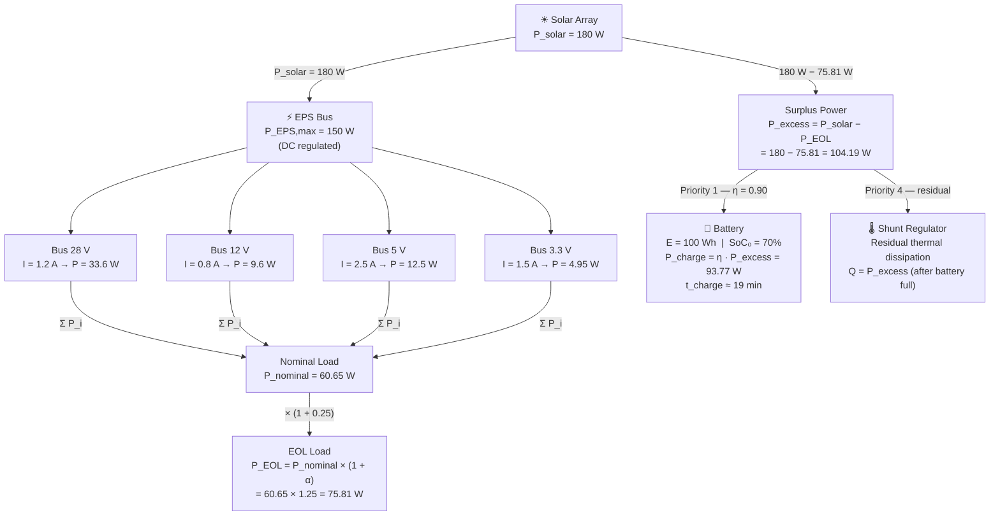
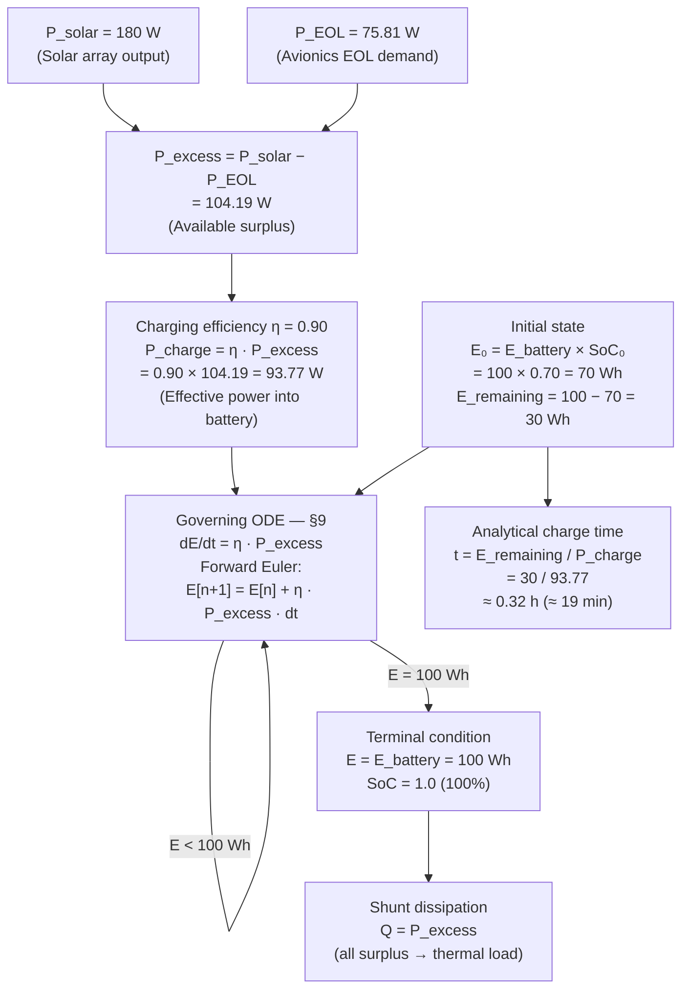
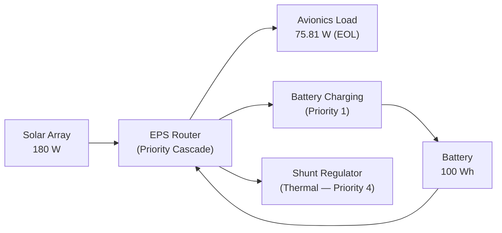
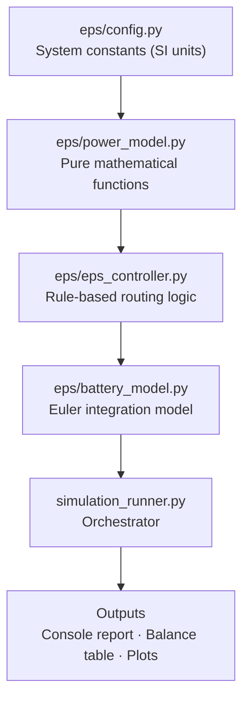
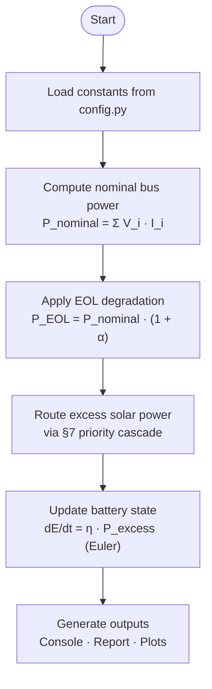

# Spacecraft Electrical Power System Simulation

**Repository:** `spacecraft-eps-power-budget`
**Reference document:** [`docs/avionics_power_budget_analysis.md`](docs/avionics_power_budget_analysis.md)

---

## Project Purpose

This repository contains the analytical power budget evaluation and deterministic simulation of a spacecraft Electrical Power System (EPS). It provides:

- Static analytical power budget evaluation across all regulated avionics buses
- End-of-life (EOL) power consumption analysis under defined degradation conditions
- Deterministic EPS simulation with time-stepped battery energy integration
- Numerical verification of all analytical results against the engineering reference document

---

## Engineering Scope

### Regulated Power Buses

The avionics system operates four regulated DC buses:

| Bus | Voltage | Load Current | Bus Power |
|-----|---------|-------------|-----------|
| Bus 1 | 28 V | 1.2 A | 33.6 W |
| Bus 2 | 12 V | 0.8 A | 9.6 W |
| Bus 3 | 5 V | 2.5 A | 12.5 W |
| Bus 4 | 3.3 V | 1.5 A | 4.95 W |

### Power Budget Objective

Evaluate whether the EPS can sustain the avionics load at both nominal and end-of-life conditions, quantify available solar surplus, and define how that surplus is allocated across battery charging, payload distribution, and shunt dissipation.

### EPS Capacity Evaluation

Maximum continuous EPS output power: **150 W**. The simulation verifies compliance at nominal load and under EOL degradation.

### Battery Energy Behavior

Battery state is propagated via forward Euler integration of the governing ODE from §9:

```
dE/dt = η · P_excess
```

---

## Diagram 1 — Spacecraft EPS Electrical Power Distribution

> **System-level electrical diagram.** Shows physical buses, voltage rails, current loads, and power values. All quantities in SI units from the engineering document.



---

## Diagram 2 — Battery Charging Physics Process

> **Physics-level process diagram.** Traces the governing equations from excess power through energy integration to state of charge, using document notation.



---

## System Power Architecture



---

## Software Architecture



---

## Simulation Workflow



---

## Key Results

All values sourced from [`docs/avionics_power_budget_analysis.md`](docs/avionics_power_budget_analysis.md).

| Parameter | Value | Source |
|-----------|-------|--------|
| Total nominal avionics load | 60.65 W | §2 |
| EPS power margin (nominal) | 89.35 W | §3 |
| End-of-life avionics load | 75.81 W | §4 |
| EPS power margin (EOL) | 74.19 W | §4 |
| Solar array generation | 180 W | §5 |
| Excess solar power | 104.19 W | §5 |
| Battery capacity | 100 Wh | §6 |
| Initial state of charge | 70% | §6 |
| Remaining storage capacity | 30 Wh | §6 |
| Charging efficiency (η) | 90% | §6 |
| Effective charging power | 93.77 W | §6 |
| Analytical charge time | ≈ 19 minutes | §6 |

---

## Verification Statement

The simulation reproduces all analytical results defined in the engineering reference document. Numerical outputs are verified by the pytest suite in `tests/test_power_calculations.py` against the document values above, using tolerance bounds appropriate to the document's own rounding precision.

See [`tests/test_power_calculations.py`](tests/test_power_calculations.py) for the complete test inventory.

---

## Repository Structure

```
spacecraft-eps-power-budget/
├── docs/
│   ├── avionics_power_budget_analysis.md   ← Primary engineering reference
│   ├── system_design.md                    ← EPS system design document
│   └── simulation_methodology.md           ← Simulation method description
├── eps/
│   ├── __init__.py
│   ├── config.py                           ← All system constants (SI units)
│   ├── power_model.py                      ← Pure mathematical functions
│   ├── battery_model.py                    ← Euler battery integration
│   └── eps_controller.py                   ← §7 routing logic
├── tests/
│   └── test_power_calculations.py          ← Pytest verification suite
├── simulation_runner.py                    ← Primary simulation entry point
├── eps_power_flow_simulation.py            ← Full EPS power flow simulation
└── README.md
```

---

## How to Run

### Prerequisites

```powershell
pip install matplotlib pytest
```

### Primary Simulation

```powershell
python simulation_runner.py
```

### Full Power Flow Simulation

```powershell
python eps_power_flow_simulation.py
```

### Verification Tests

```powershell
pytest tests/test_power_calculations.py -v
```
