# Spacecraft Electrical Power System Simulation

**Repository:** `spacecraft-eps-power-budget`
**Reference document:** [`docs/avionics_power_budget_analysis.md`](docs/avionics_power_budget_analysis.md)

---

## Project Purpose

This repository contains the analytical power budget evaluation and deterministic simulation of a spacecraft Electrical Power System (EPS). It provides:

- Static analytical power budget evaluation across all regulated avionics buses
- End-of-life (EOL) power consumption analysis under defined degradation conditions
- Deterministic EPS simulation with time-stepped battery energy integration
- Numerical verification of all analytical results against the engineering reference document

---

## Engineering Scope

### Regulated Power Buses

The avionics system operates four regulated DC buses:

| Bus | Voltage | Load Current | Bus Power |
|-----|---------|-------------|-----------|
| Bus 1 | 28 V | 1.2 A | 33.6 W |
| Bus 2 | 12 V | 0.8 A | 9.6 W |
| Bus 3 | 5 V | 2.5 A | 12.5 W |
| Bus 4 | 3.3 V | 1.5 A | 4.95 W |

### Power Budget Objective

Evaluate whether the EPS can sustain the avionics load at both nominal and end-of-life conditions, quantify available solar surplus, and define how that surplus is allocated across battery charging, payload distribution, and shunt dissipation.

### EPS Capacity Evaluation

Maximum continuous EPS output power: **150 W**. The simulation verifies compliance at nominal load and under EOL degradation.

### Battery Energy Behavior

Battery state is propagated via forward Euler integration of the governing ODE from §9:

```
dE/dt = η · P_excess
```

---

## Diagram 1 — Spacecraft EPS Electrical Power Distribution

> **System-level electrical diagram.** Shows physical buses, voltage rails, current loads, and power values. All quantities in SI units from the engineering document.

```mermaid
flowchart TD
    %% Styling
    classDef default font-family:Inter,font-size:16px,color:#333,stroke-width:2px;
    classDef bus fill:#fff9c4,stroke:#fbc02d,stroke-width:3px;
    classDef source fill:#e1f5fe,stroke:#01579b,stroke-width:3px;
    classDef load fill:#f1f8e9,stroke:#558b2f,stroke-width:2px;
    classDef critical fill:#ffebee,stroke:#b71c1c,stroke-width:3px;

    SA["☀ Solar Array\nP_solar = 180 W"]:::source

    EPS["⚡ EPS Bus\nP_EPS,max = 150 W\n(DC regulated)"]:::highlight

    subgraph RegulatedBuses [Regulated Avionics Buses]
        direction TB
        B28["Bus 28 V\nI = 1.2 A  →  P = 33.6 W"]:::load
        B12["Bus 12 V\nI = 0.8 A  →  P = 9.6 W"]:::load
        B5["Bus 5 V\nI = 2.5 A  →  P = 12.5 W"]:::load
        B3["Bus 3.3 V\nI = 1.5 A  →  P = 4.95 W"]:::load
    end

    PNOM["Nominal Load\nP_nominal = 60.65 W"]:::bus
    PEOL["EOL Load\nP_EOL = P_nominal × (1 + α)\n= 60.65 × 1.25 = 75.81 W"]:::critical

    PEXC["Surplus Power\nP_excess = P_solar − P_EOL\n= 104.19 W"]:::source

    BAT["🔋 Battery\nE = 100 Wh  |  SoC₀ = 70%\nP_charge = η · P_excess = 93.77 W\nt_charge ≈ 19 min"]:::highlight

    SHT["Host Shunt Regulator\nResidual thermal dissipation\nQ = P_excess (after battery full)"]:::critical

    SA -->|"P_solar = 180 W"| EPS
    EPS --> RegulatedBuses
    RegulatedBuses -->|"Σ P_i"| PNOM
    PNOM -->|"× (1 + 0.25)"| PEOL
    SA -->|"180 W − 75.81 W"| PEXC
    PEXC -->|"Priority 1 — η = 0.90"| BAT
    PEXC -->|"Priority 4 — residual"| SHT
```



---

## Diagram 2 — Battery Charging Physics Process

> **Physics-level process diagram.** Traces the governing equations from excess power through energy integration to state of charge, using document notation.

```mermaid
flowchart TD
    P1["P_solar = 180 W\n(Solar array output)"]
    P2["P_EOL = 75.81 W\n(Avionics EOL demand)"]

    P3["P_excess = P_solar − P_EOL\n= 104.19 W\n(Available surplus)"]

    P4["Charging efficiency η = 0.90\nP_charge = η · P_excess\n= 0.90 × 104.19 = 93.77 W\n(Effective power into battery)"]

    P5["Initial state\nE₀ = E_battery × SoC₀\n= 100 × 0.70 = 70 Wh\nE_remaining = 100 − 70 = 30 Wh"]

    P6["Governing ODE — §9\ndE/dt = η · P_excess\nForward Euler:\nE[n+1] = E[n] + η · P_excess · dt"]

    P7["Analytical charge time\nt = E_remaining / P_charge\n= 30 / 93.77\n≈ 0.32 h  (≈ 19 min)"]

    P8["Terminal condition\nE = E_battery = 100 Wh\nSoC = 1.0  (100%)"]

    P9["Shunt dissipation\nQ = P_excess\n(all surplus → thermal load)"]

    P1 & P2 --> P3
    P3 --> P4
    P4 & P5 --> P6
    P6 -->|"E < 100 Wh"| P6
    P6 -->|"E = 100 Wh"| P8
    P5 --> P7
    P8 --> P9
```



---

## Spacecraft Physical Architecture

> **Spacecraft Integrated Layout.** This diagram visualizes the physical and logical placement of components within the spacecraft frame.


---

## System Power Architecture

```mermaid
flowchart TD
    %% Styling
    classDef default font-family:Inter,font-size:16px,color:#333,stroke-width:2px;
    classDef nodeStyle fill:#ffffff,stroke:#333,stroke-width:2px;
    classDef highlight fill:#e3f2fd,stroke:#1565c0,stroke-width:3px;

    SolarArray["Solar Array\n180 W"]:::highlight
    EPS["EPS Router\n(Priority Cascade)"]:::highlight
    
    AvionicsLoad["Avionics Load\n75.81 W (EOL)"]:::nodeStyle
    BatteryCharging["Battery Charging\n(Priority 1)"]:::nodeStyle
    ShuntRegulator["Shunt Regulator\n(Thermal — Priority 4)"]:::nodeStyle
    
    Battery["Battery\n100 Wh"]:::nodeStyle

    SolarArray --> EPS
    EPS --> AvionicsLoad
    EPS --> BatteryCharging
    EPS --> ShuntRegulator
    BatteryCharging --> Battery
    Battery --> EPS
```



---

## Software Architecture

```mermaid
flowchart TD
    %% Styling
    classDef default font-family:Inter,font-size:16px,color:#333,stroke-width:2px;
    classDef logic fill:#f3e5f5,stroke:#7b1fa2,stroke-width:2px;
    classDef runner fill:#e8eaf6,stroke:#1a237e,stroke-width:3px;

    Config["eps/config.py\nSystem constants (SI units)"]:::logic
    PowerModel["eps/power_model.py\nPure mathematical functions"]:::logic
    EPSController["eps/eps_controller.py\nRule-based routing logic"]:::logic
    BatteryModel["eps/battery_model.py\nEuler integration model"]:::logic
    SimulationRunner["simulation_runner.py\nOrchestrator"]:::runner
    Results["Outputs\nConsole report · Balance table · Plots"]:::runner

    Config --> PowerModel
    PowerModel --> EPSController
    EPSController --> BatteryModel
    BatteryModel --> SimulationRunner
    SimulationRunner --> Results
```



---

## Simulation Workflow

```mermaid
flowchart TD
    %% Styling
    classDef default font-family:Inter,font-size:16px,color:#333,stroke-width:2px;
    classDef step fill:#fafafa,stroke:#616161,stroke-width:2px;
    classDef startEnd fill:#eceff1,stroke:#455a64,stroke-width:3px;

    Start(["Start"]):::startEnd
    LoadParameters["Load constants from config.py"]:::step
    ComputePowerDemand["Compute nominal bus power\nP_nominal = Σ V_i · I_i"]:::step
    ApplyEOLConditions["Apply EOL degradation\nP_EOL = P_nominal · (1 + α)"]:::step
    RoutePower["Route excess solar power\nvia §7 priority cascade"]:::step
    UpdateBatteryState["Update battery state\ndE/dt = η · P_excess  (Euler)"]:::step
    GenerateOutputs["Generate outputs\nConsole · Report · Plots"]:::step

    Start --> LoadParameters
    LoadParameters --> ComputePowerDemand
    ComputePowerDemand --> ApplyEOLConditions
    ApplyEOLConditions --> RoutePower
    RoutePower --> UpdateBatteryState
    UpdateBatteryState --> GenerateOutputs
```



---

## Key Results

All values sourced from [`docs/avionics_power_budget_analysis.md`](docs/avionics_power_budget_analysis.md).

| Parameter | Value | Source |
|-----------|-------|--------|
| Total nominal avionics load | 60.65 W | §2 |
| EPS power margin (nominal) | 89.35 W | §3 |
| End-of-life avionics load | 75.81 W | §4 |
| EPS power margin (EOL) | 74.19 W | §4 |
| Solar array generation | 180 W | §5 |
| Excess solar power | 104.19 W | §5 |
| Battery capacity | 100 Wh | §6 |
| Initial state of charge | 70% | §6 |
| Remaining storage capacity | 30 Wh | §6 |
| Charging efficiency (η) | 90% | §6 |
| Effective charging power | 93.77 W | §6 |
| Analytical charge time | ≈ 19 minutes | §6 |

---

## Verification Statement

The simulation reproduces all analytical results defined in the engineering reference document. Numerical outputs are verified by the pytest suite in `tests/test_power_calculations.py` against the document values above, using tolerance bounds appropriate to the document's own rounding precision.

See [`tests/test_power_calculations.py`](tests/test_power_calculations.py) for the complete test inventory.

---

## Repository Structure

```
spacecraft-eps-power-budget/
├── docs/
│   ├── avionics_power_budget_analysis.md   ← Primary engineering reference
│   ├── system_design.md                    ← EPS system design document
│   └── simulation_methodology.md           ← Simulation method description
├── eps/
│   ├── __init__.py
│   ├── config.py                           ← All system constants (SI units)
│   ├── power_model.py                      ← Pure mathematical functions
│   ├── battery_model.py                    ← Euler battery integration
│   └── eps_controller.py                   ← §7 routing logic
├── tests/
│   └── test_power_calculations.py          ← Pytest verification suite
├── simulation_runner.py                    ← Primary simulation entry point
├── eps_power_flow_simulation.py            ← Full EPS power flow simulation
└── README.md
```

---

## How to Run

### Prerequisites

```powershell
pip install matplotlib pytest
```

### Primary Simulation

```powershell
python simulation_runner.py
```

### Full Power Flow Simulation

```powershell
python eps_power_flow_simulation.py
```

### Verification Tests

```powershell
pytest tests/test_power_calculations.py -v
```

---

## Engineering Design Philosophy

- **Implementation is document-driven**: All logic stems directly from the engineering analysis.
- **Simulation implements equations defined in analysis document**: No deviation from §9 symbolic models.
- **Deterministic power routing priority**: Rule-based allocation follows a strict hierarchical cascade.
- **Simulation used for verification, not discovery**: The software serves to numerically validate the theoretical budget.
- **No optimisation, estimation, or inferred physics**: Only defined system parameters and governing equations are modeled.
- **Forward Euler integration for battery energy evolution**: Time-stepped propagation of battery state follows $E[n+1] = E[n] + \eta \cdot P_{excess} \cdot dt$.
- **Architecture reflects spacecraft EPS control logic**: Software modules are partitioned according to physical system functions.

---

## EPS Power Flow Architecture


- **Solar array provides generation**: Primary source of system power (180 W).
- **EPS distributes power**: Regulated bus manages routing to all sinks.
- **Avionics load has highest priority**: Critical system demand must be satisfied first.
- **Battery stores surplus energy**: Excess solar power is converted to chemical energy (90% efficiency).
- **Shunt dissipates residual power**: Thermal load when generation exceeds load and storage capacity.

---

## Simulation Control Logic


Step-by-step deterministic execution sequence:
1. **Compute Nominal Load**: Summation of all regulated bus power values ($V \cdot I$).
2. **Apply EOL Degradation**: Factoring in the 25% end-of-life degradation coefficient.
3. **Compute Excess Solar Power**: Calculation of the instantaneous delta between generation and avionics demand.
4. **Route Power by Priority**: Algorithmic distribution of available power based on the §7 strategy.
5. **Update Battery Energy**: Time-stepped numerical integration of the battery energy storage state.

---

## Deterministic Power Routing Priority

The EPS controller implements a strict modular cascade to manage power flow:

1. **Avionics load supplied from solar**: The solar array generation ($P_{solar}$) is first applied to meet the avionics demand ($P_{EOL}$).
2. **Remaining power charges battery**: Any surplus power ($P_{excess} = P_{solar} - P_{EOL}$) is routed to the battery with charging efficiency $\eta$.
3. **Residual power dissipated in shunt**: Once the battery reaches maximum capacity (100 Wh), remaining power is diverted to the shunt regulator as thermal dissipation.
4. **Battery energy updated using forward Euler**: The energy state of the battery is updated at each timestep using the governing equation $dE/dt = \eta P_{excess}$.

---

## Role of Simulation in Design Verification

The simulation acts as the numerical implementation of the theoretical model defined in §9. It serves to verify:

- **Power balance**: Confirmation that $P_{load} + P_{charge} + P_{shunt} = P_{generation}$.
- **Battery charging behavior**: Verification of the analytical charge time ($\approx 19$ minutes) through time-stepped integration.
- **Energy saturation behavior**: Validation of the shunt transition once the State of Charge (SoC) reaches 100%.
- **EPS routing correctness**: Compliance with the priority hierarchy across varying system states.

---     

### Submission Repository

https://github.com/chetan0021/spacecraft-eps-power-budget

