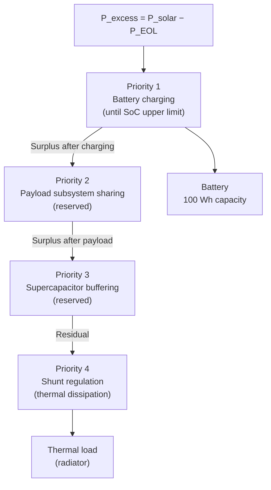

# EPS System Design

**Document type:** System design reference
**Primary source:** [`avionics_power_budget_analysis.md`](avionics_power_budget_analysis.md)

---

## 1. System Overview

The spacecraft Electrical Power System (EPS) supplies regulated DC power to all avionics subsystems from a solar array, with a battery providing energy storage during eclipse and load transients. The system operates four regulated voltage buses, and all surplus solar power is managed through a defined routing priority hierarchy.

All design parameters are fixed by the engineering reference document. No parameters have been derived or estimated beyond those specified.

---

## 2. Power Flow Description

The EPS power flow originates at the solar array and is distributed through five functional stages:

1. **Solar generation** — 180 W rated output from the solar array.
2. **Avionics load supply** — the regulated buses draw their defined load currents at steady state.
3. **Surplus computation** — excess power after satisfying the EOL avionics load is computed.
4. **Priority routing** — surplus power is dispatched through the §7 priority cascade.
5. **Shunt dissipation** — all power not consumed by higher-priority sinks is dissipated as heat.

The battery participates in two directions: it absorbs surplus during charging and can supply the EPS bus during eclipse. Battery discharge behavior is defined but not dynamically simulated; the simulation covers the charging regime only, consistent with the reference document scope.

---

## 3. EPS Functional Responsibilities

| Function | Description | Reference |
|---|---|---|
| Load power computation | Compute `P_i = V_i · I_i` per bus; sum to `P_nominal` | §2 |
| EOL evaluation | Scale `P_nominal` by `(1 + α)` to obtain worst-case load | §4 |
| Compliance check | Verify `P_EOL < P_EPS,max = 150 W` | §3, §4 |
| Solar balance | Compute `P_excess = P_solar − P_EOL` | §5 |
| Routing | Allocate `P_excess` via four-priority cascade | §7 |
| Battery charging | Integrate `dE/dt = η · P_excess` via forward Euler | §6, §9 |
| Shunt regulation | Dissipate all unrouted power thermally | §7, §8 |

---

## 4. Energy Routing Logic

Routing follows the strict priority order defined in §7. Each priority stage claims as much power as it requires; the residual passes to the next stage.



### Routing rules

| Priority | Sink | Condition | Action |
|---|---|---|---|
| 1 | Battery | SoC < upper limit | Route all surplus to battery |
| 1 | Battery | SoC ≥ upper limit | Route 0 W to battery |
| 2 | Payload | (reserved) | 0 W in current implementation |
| 3 | Supercapacitor | (reserved) | 0 W in current implementation |
| 4 | Shunt | Always | Absorb all remaining surplus |

**Power conservation identity** holds at every timestep:

```
P_battery + P_payload + P_supercap + P_shunt = P_excess
```

---

## 5. Operational Interpretation

**Thermal load (§8):** Unrouted surplus power is dissipated as heat through shunt regulation. At the reference operating point, once the battery is fully charged, the full 104.19 W surplus reaches the shunt. This imposes radiator sizing and thermal management constraints not modelled in the present simulation.

**Battery health (§8):** Improper charge control can cause accelerated capacity degradation and thermal stress. The SoC upper limit parameter in the routing controller is provided to allow charge curtailment before 100% SoC if required by battery management constraints.

**Bus stability (§8):** Adequate EPS margin (89.35 W at nominal conditions) is necessary to prevent bus overvoltage, converter stress, and avionics latch-up. The simulation verifies this margin at both nominal and EOL conditions.

**Eclipse regime:** During eclipse, `P_solar = 0` and `P_excess < 0`. The battery must supply the avionics load. Discharge behaviour is defined by the same governing equation with `P_excess < 0`; this regime is not the primary scope of the current simulation.
